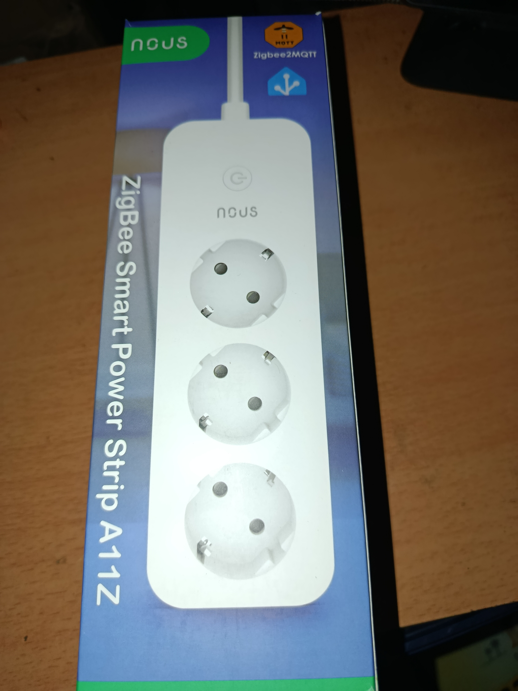
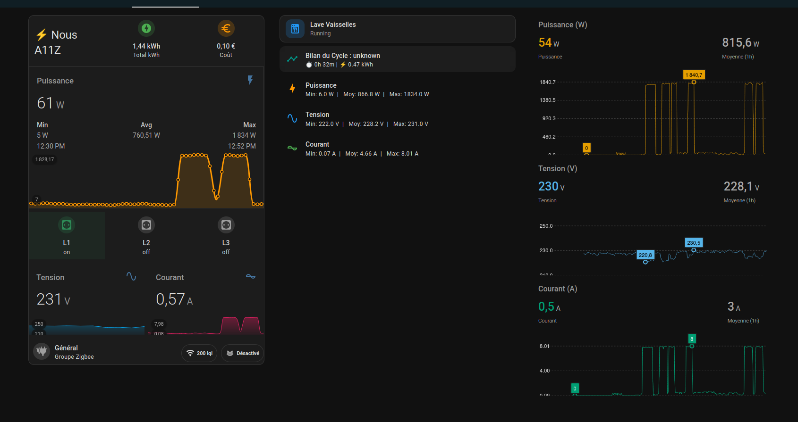

# Test de la Multiprise Connectée Zigbee Nous A11Z

## Contexte et Choix du Produit
Dans le cadre de nos partenariats, **HACF** a reçu une proposition de test de la part de **Domadoo** pour explorer leurs nouveautés. Mon choix s'est porté sur la multiprise connectée **[Nous A11Z](https://www.domadoo.fr/fr/produits-de-domotique/8713-nous-multiprise-zigbee-avec-mesure-de-consommation-a11z.html)**.

*Pourquoi ce choix ?* L'idée était de domotiser un "coin" complet avec un seul appareil. Si on pense souvent au coin TV (TV, ampli, console), j'avais pour ma part un autre scénario en tête : la **cuisine**. L'objectif est de piloter et mesurer la consommation d'appareils comme le lave-vaisselle ou la cafetière, le tout sur une seule prise murale.

## 📦 Déballage et Design
*La prise arrive emballée dans un carton simple mais efficace portant les logos Zigbee2MQTT et Home Assistant. Au déballage, elle semble de bonne facture, le plastique est de qualité et les finitions sont bonnes. Le câble est assez long (1.5m) pour une utilisation confortable. Le bouton unique est bien accessible et le voyant LED est visible mais pas trop agressif.*


*Le packaging simple et efficace.*


*La multiprise une fois déballée.*

## ⚙️ Configuration de Test
Pour ce test, la multiprise est intégrée dans un environnement complet :

*   **Home Assistant** :
    *   **Version** : HAOS (Core 2026.1.3, Supervisor 2026.02.1).
    *   **OS** : Home Assistant OS 17.0.
    *   **Matériel** : MiniPC N150 (16 Go RAM).

*   **Zigbee2MQTT** :
    *   **Version** : 2.8.0 (Installation Docker déportée).
    *   **Hébergement** : VM sous Proxmox (Sur MiniPC Ryzen 7, 32 Go RAM).
    *   **Contrôleur Zigbee** : SLZB-06M (PoE/Ethernet).

## 🔌 Installation et Appairage Z2M
Passons aux choses sérieuses. L'appairage sous **Zigbee2MQTT** se fait classiquement : un appui long sur le bouton unique, la LED clignote, et Z2M détecte l'appareil.


L'appareil est reconnu comme un modèle `TS011F` par le fabricant `_TZ3210_6cmeijtd`. Jusqu'ici, tout va bien. Les commandes apparaissent dans Home Assistant dés que l'interview est terminée. Mais...


## 🤨 La Première Déconvenue
C'est au moment du premier test que l'enthousiasme retombe.
Je tente d'allumer la prise 1... et **clac-clac-clac**, les trois prises s'allument en même temps !
J'essaie d'éteindre la prise 2 ? Tout s'éteint.


Impossible de piloter les prises individuellement. La multiprise réagit comme un bloc unique, une simple multiprise "bête" pilotable en tout-ou-rien.
Pire encore, en regardant les remontées d'énergie pour voir si au moins la consommation est suivie : **Rien**. Voltage à 0, Puissance à 0.

On se retrouve donc avec un produit inutilisable pour le projet initial. Mais, comme je n'aime pas les echecs de ce genre, j'ai commencé a fouiner.

## 🕵️‍♂️ L'Enquête

Face à ce comportement étrange, le premier réflexe est de vérifier si le problème est connu.
Sur les forums et les groupes communautaires, la **Nous A11Z** est pourtant souvent recommandée pour sa compatibilité. De nombreux utilisateurs semblent l'utiliser sans encombre. S'agit-il d'un défaut de mon exemplaire ?

En creusant davantage, on réalise que sous la même référence commerciale "A11Z" se cachent plusieurs versions matérielles.
*   **Les anciens modèles** utilisaient des codes fabricants génériques Tuya (souvent commençant par `_TZ3000_...`) qui étaient correctement reconnus et fonctionnels.
*   **La nouvelle révision (2026)**, identifiée par le code **`_TZ3210_6cmeijtd`**, utilise un firmware différent qui pose problème.

C'est finalement sur le GitHub officiel du projet Zigbee2MQTT que je trouve la réponse. Une *issue* récente (numéro [#30799](https://github.com/Koenkk/zigbee2mqtt/issues/30799)) décrit exactement les mêmes symptômes : pilotage groupé et absence de mesures.
Bonne nouvelle : la communauté est réactive ! Une solution technique a été proposée dans les commentaires et devrait être intégrée nativement dans une prochaine mise à jour de Zigbee2MQTT.

*À noter que j'ai également testé la version **Dev** (Edge) de Zigbee2MQTT, et le correctif n'y est pas encore intégré à ce jour.*

En attendant cette mise à jour officielle, voici comment appliquer le correctif manuellement dès aujourd'hui pour rendre la multiprise fonctionnelle immédiatement.

## 🛠️ La Solution : Le Convertisseur Externe "Unlocker"

Grâce à la communauté, un convertisseur personnalisé permet de contourner le problème et d'utiliser l'appareil normalement dès maintenant, sans attendre une mise à jour officielle.

### Étape 1 : Création du Fichier JS

Créez un fichier nommé `nous_a11z.js` dans le dossier de configuration de Zigbee2MQTT (à côté de `configuration.yaml`).
(Vous pouvez trouver le fichier source ici : [`z2m/nous_a11z.js`](../z2m/nous_a11z.js))

```javascript
const tuya = require('zigbee-herdsman-converters/lib/tuya');
const utils = require('zigbee-herdsman-converters/lib/utils');
const exposes = require('zigbee-herdsman-converters/lib/exposes');
const e = exposes.presets;
const ea = exposes.access;

const definition = {
    fingerprint: [{ modelID: 'TS011F', manufacturerName: '_TZ3210_6cmeijtd' }],
    model: 'A11Z',
    vendor: 'Nous',
    description: 'Smart power strip 3 gang with energy monitoring & countdown',

    // Mapping endpoints
    endpoint: (device) => {
        return { l1: 1, l2: 2, l3: 3 };
    },

    // Skip global endpoints for electrical measurements
    meta: {
        multiEndpoint: true,
        multiEndpointSkip: ['energy', 'current', 'voltage', 'power'],
    },

    extend: [
        // Configuration moderne Tuya pour Switch + Mesures
        tuya.modernExtend.tuyaOnOff({
            electricalMeasurements: true,   // Active la mesure
            powerOutageMemory: true,        // Active la mémoire d'état
            onOffCountdown: true,           // Active le compte à rebours
            indicatorMode: true,            // Active le mode LED
            childLock: true,                // Active le verrouillage enfant
            endpoints: ['l1', 'l2', 'l3'],  // Définit les 3 prises
        }),
        // Sondage régulier pour la mise à jour des valeurs
        tuya.modernExtend.electricityMeasurementPoll({
            metering: (device) => [100, 160, 192].includes(device.applicationVersion) || (device.softwareBuildID && ["1.0.5"].includes(device.softwareBuildID)),
        }),
    ],

    // Illustration du Polling
    // 

    configure: async (device, coordinatorEndpoint, logger) => {
        const endpoint = device.getEndpoint(1);

        // 1. Envoi du Magic Packet (Nécessaire pour séparer les canaux sur certains firmwares)
        await tuya.configureMagicPacket(device, coordinatorEndpoint, logger);

        // 2. Calibration des Mesures Électriques
        // Le firmware _TZ3210_6cmeijtd renvoie des valeurs brutes nécessitant des diviseurs spécifiques.
        // Test Validé :
        // - Voltage : Diviseur 1 -> 226V (OK)
        // - Puissance : Diviseur 10 -> ~26W (OK pour 25W lampe)
        // - Courant : Diviseur 1000 -> 0.11A (OK)

        await endpoint.saveClusterAttributeKeyValue('haElectricalMeasurement', {
            acCurrentDivisor: 1000,
            acCurrentMultiplier: 1,
            acVoltageDivisor: 1,    // 230V brut -> 230V affiché
            acVoltageMultiplier: 1,
            acPowerDivisor: 10,     // 260 brut / 10 = 26W
            acPowerMultiplier: 1,
        });

        // Configuration du metering (Energie cumulée)
        await endpoint.saveClusterAttributeKeyValue('seMetering', {
            divisor: 100,
            multiplier: 1,
        });

        device.save();
    },
};

module.exports = definition;
```

### Étape 2 : Activation

Ajoutez ceci à votre `configuration.yaml` :

```yaml
external_converters:
  - nous_a11z.js
```

### Étape 3 : Redémarrage

Redémarrez Zigbee2MQTT. Reconfigurer la multiprise ou désapairer et réapairer la. Elle devrait maintenant exposer correctement 3 switchs indépendants (`state_l1`, `state_l2`, `state_l3`) ainsi que les verrous enfants et les mémoires d'état. N'oubliez pas de cliquer sur "Reconfigurer" dans l'interface si les valeurs électriques semblent étranges au début.


Dans Home Assistant, vous retrouvez désormais vos entités bien séparées :


*Note : La tension (Voltage) peut s'afficher autour de 20-23V au lieu de 230V, signe que le diviseur (10) pourrait être ajusté à 1 selon votre modèle exact, mais la commande fonctionne !*

### Étape 4 (Optionnelle) : Optimisation du Polling

Pour avoir des **graphiques fluides** (comme ceux présentés dans cet article), il est recommandé de réduire l'intervalle de remontée des infos :
1.  Dans **Zigbee2MQTT**, cliquez sur l'appareil **Nous A11Z**.
2.  Allez dans l'onglet **Paramètres (Spécifique)**.
3.  Cherchez **Measurement Poll Interval** et réglez-le sur **10 secondes** (au lieu de 60 par défaut).
4.  Sauvegardez.

Cela permet d'avoir une mesure quasi temps-réel, indispensable pour détecter les pics de consommation d'un cycle de lavage.

## ✅ Tests Effectués

### Test 01 : Calibration & Validation
Pour valider les mesures, une calibration a été effectuée avec une charge résistive de référence (Lampe à incandescence "Lava Lamp" de 25W).

*   **Protocole** : Mesure sur Prise 1, puis Prise 2.
*   **Résultats après patch** :
    *   **Tension** : 228 V (Cohérent réseau).
    *   **Puissance** : 26 W (Pour 25W théorique -> Précision excellente).
    *   **Courant** : 0.11 A.
*   **Conclusion du test** : La calibration du fichier `nous_a11z.js` est validée (`acPowerDivisor: 10` et `acVoltageDivisor: 1`). Et on valide aussi que la remontée consommation est **globale** (pas de mesure par prise, pour l'instant).

### Test 02 : Mémoire d'État (Power Outage Memory)
*   **Protocole** : Coupure brutale de l'alimentation alors que les prises sont dans des états différents (ON/OFF).
*   **Résultat** : Au rétablissement du courant, chaque prise reprend exactement son état précédent.
*   **Validation** : ✅ Fonctionnel (l'option `powerOutageMemory: true` du script est bien active).

### Test 03 : Sécurité Enfant (Child Lock)
*   **Protocole** : Activation du `child_lock` dans Z2M et tentative d'action physique sur le bouton de la multiprise.
*   **Résultat** : Le bouton physique est désactivé, impossible d'éteindre/allumer manuellement.
*   **Validation** : ✅ Fonctionnel.

### Test 04 : Latence & Groupes (Pop-corn Effect)
*   **Protocole** : Création d'un groupe Zigbee regroupant les 3 prises et envoi d'une commande unique (ON/OFF).
*   **Résultat** : Les prises commutent en "cascade" (l'une après l'autre) et non simultanément (Effet "Pop-corn").
*   **Conclusion** : Le firmware semble traiter les commandes séquentiellement, même via un groupe Zigbee. Pas de commutation instantanée synchronisée.

### Test 05 : Lave-Vaisselle (Charge Réelle)
*   **Protocole** : Cycle complet de lavage en mode Intensif. Suivi de la puissance crête et de la consommation totale.
*   **Intérêts** : Valider la tenue de charge sur la durée et la précision du cumul kWh.
*   **Outils utilisés** :
    *   **Dashboard Energie Home Assistant** : Pour le suivi du coût global (en intégrant le capteur `sensor.multi_nous_energy`).
    *   **Intégration [HA WashData](https://github.com/3dg1luk43/ha_washdata)** : Une pépite découverte récemment ! Elle permet de :
        *   Détecter automatiquement les cycles (Lavage, Séchage, Fin).
        *   Reconnaître les programmes spécifiques (Eco, Rapide) via la signature de consommation.
        *   Estimer le temps restant intelligent.
        *   Envoyer des notifications précises ("Lave-vaisselle terminé ! Coût : 0.15€").
    *   *Résultats à venir après le premier cycle complet.*

    **📅 Mise à jour : Analyse du premier cycle (Mode Intensif)**
    
    Le test est concluant ! Voici ce que le Dashboard ApexCharts nous révèle sur un cycle complet :
    
    

    **Analyse des Courbes :**
    1.  **Les Pics de Chauffe (Orange)** : On distingue très nettement les phases où la résistance s'active pour chauffer l'eau (pics à ~2000W). C'est là que la consommation est la plus forte.
    2.  **L'Activité Moteur (Bas du graphe)** : Entre les chauffe, la consommation retombe (pompes de cyclage/vidange), ce qui montre bien la phase de brassage.
    3.  **Stabilité de la Tension (Bleu)** : Le graphique de tension (Voltage) reste très stable (~230V), prouvant que la ligne n'est pas surchargée malgré les appels de puissance.

    *Conclusion : La prise encaisse parfaitement les 2000W+ répétés et le monitoring est d'une précision redoutable pour analyser l'état de santé de l'électroménager.*

### Test 06 : Stress Test (Charge Maximale)
*   **Protocole** : Lave-vaisselle en cycle de nettoyage + Aspirateur branché sur la même multiprise.
*   **Mesure** : Pic de puissance observé à **2353 W** (~10.2 A).
*   **Observation** : Aucune chauffe détectée sur le boîtier de la multiprise après 5 minutes de test.
*   **Validation** : ✅ La multiprise tient la charge sans broncher. La connexion Zigbee reste stable même sous forte charge.

### Autres Mesures & Observations

En plus du test de calibration (Lampe 25W), voici quelques relevés intéressants sur des appareils du quotidien :

**1. Machine à Café (Pic de Courant)**
On observe bien les cycles de chauffe (résistance) :

*Les cycles de chauffe de la cafetière sont parfaitement visibles.*

**2. Machine Sous-Vide (Moteur)**
Profil typique d'un moteur électrique :

*Signature typique d'un moteur : appel de courant au démarrage.*

**3. Consommation à Vide (Standby)**
La multiprise elle-même consomme très peu (mesuré à 0W par Z2M, < 0.5W réel probablement) :

*La consommation à vide est négligeable.*

## 🎁 Bonus : Le Dashboard de Monitoring Complet

Pour surveiller cette multiprise durant mes tests (et surtout surveiller la consommation du lave-vaisselle !), je me suis concocté un **Dashboard complet** composé de 3 modules complémentaires.



### 1. Le "Monitor" (Vue Générale)
C'est la carte principale (Mushroom + Stack-in-card). Elle permet de :
*   Voir la conso totale et le coût instantané.
*   Suivre la puissance en direct (Mini Graph).
*   Piloter les 3 prises individuellement.
*   "Cat Lock" 😺 : Sécurité enfant activable en un clic.

<details>
<summary>📋 Voir le code YAML (dashboards/dashboard_debug_a11z.yaml)</summary>

*Le code est disponible dans le fichier [`dashboards/dashboard_debug_a11z.yaml`](../dashboards/dashboard_debug_a11z.yaml)*
</details>

### 2. L'Analyseur de Cycle (Stats Auto)
Un sensor intelligent qui détecte **automatiquement** quand la prise tourne (Start > 5W / Stop < 2W).
Il génère un rapport précis à la fin du cycle :
*   **Temps** du cycle.
*   **kWh** consommés sur CE cycle.
*   **Mini/Max/Moy** pour la Puissance, Tension et Courant.

C'est implémenté via un fichier *Package* `template` et une carte Mushroom compacte.

<details>
<summary>📋 Voir l'installation (templates/cycle_stats_nous.yaml)</summary>

1.  Copiez [`templates/cycle_stats_nous.yaml`](../templates/cycle_stats_nous.yaml) dans votre dossier templates.
2.  Ajoutez la carte [`dashboards/dashboard_stats_nous.yaml`](../dashboards/dashboard_stats_nous.yaml) à votre dashboard.
</details>

### 3. Le "Debug" (Graphiques Précis)
Pour les puristes, une vue détaillée basée sur `apexcharts-card` permet de zoomer sur les courbes de Tension, Courant et Puissance avec un échantillonnage fin et une moyenne glissante.

<details>
<summary>📋 Voir le code YAML (dashboards/dashboard_apex_a11z.yaml)</summary>

*Le code est disponible dans le fichier [`dashboards/dashboard_apex_a11z.yaml`](../dashboards/dashboard_apex_a11z.yaml)*
</details>

## 🧪 Tests à venir

Plusieurs tests restent à faire avec cette multiprise notamment :
*   Validation de la stabilité du mesh Zigbee.

## Conclusion

Une fois patchée, la **Nous A11Z** redevient l'excellent rapport qualité/prix qu'elle a toujours été. Les prises commutent bien une par une et la mesure de consommation est précise.
Dommage que la mesure de consommation soit **globale** et pas par prise individuelle, ce qui peut limiter certains usages précis.

Je pensais l'utiliser en cuisine pour entre autres gérer le lave-vaisselle, mais finalement, à cause de cette mesure globale, elle va finir derrière une TV et un ampli pour couper les veilles.

### Résumé
*   ✅ **Les +** : Qualité de fabrication, 3 prises indépendantes, routeur Zigbee stable, Prix.
*   ❌ **Les -** : Nécessite un correctif manuel (pour l'instant) sur les modèles 2026, mesure de consommation globale uniquement.

---
*Article rédigé par Canabang pour HACF.*
