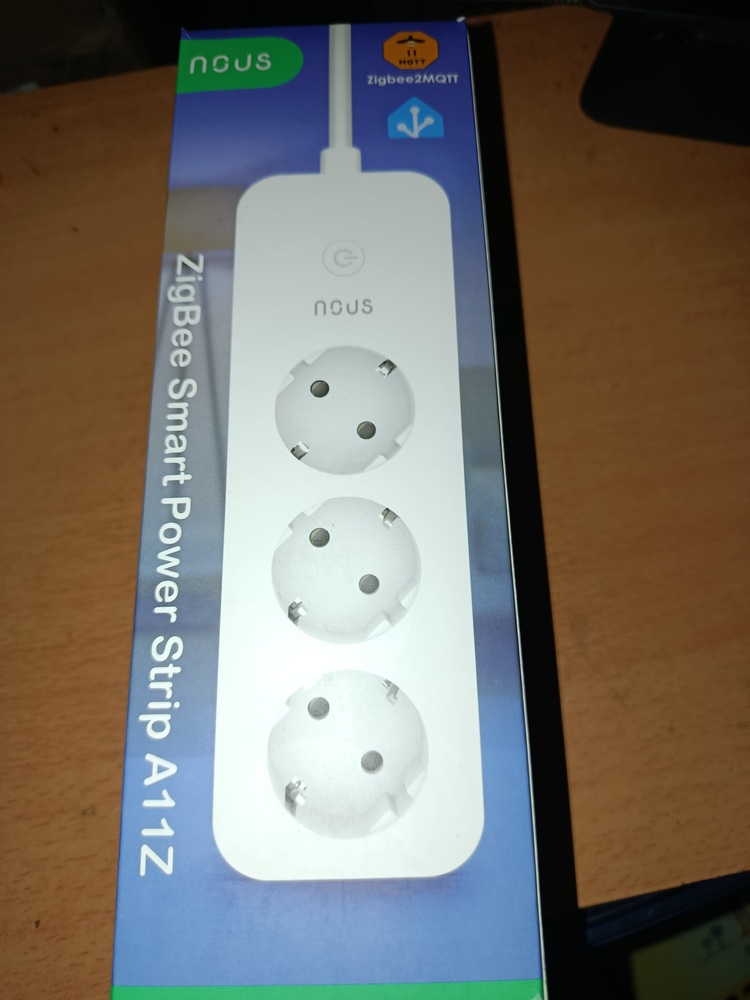
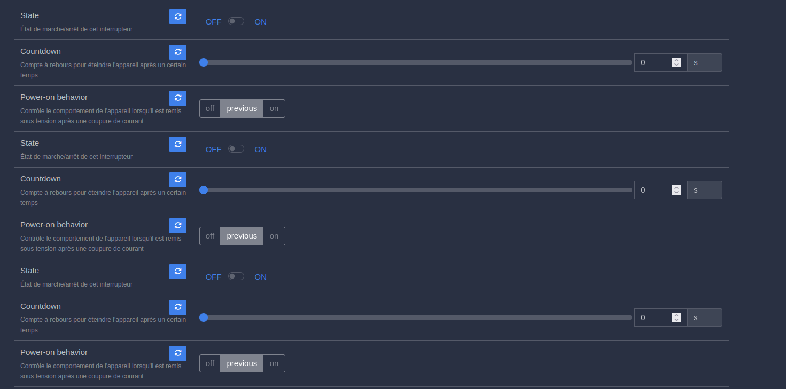
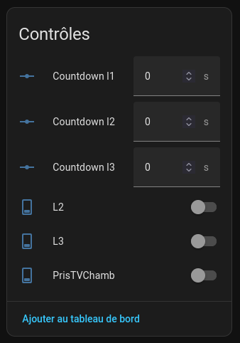
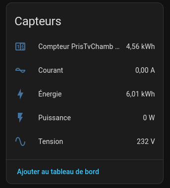
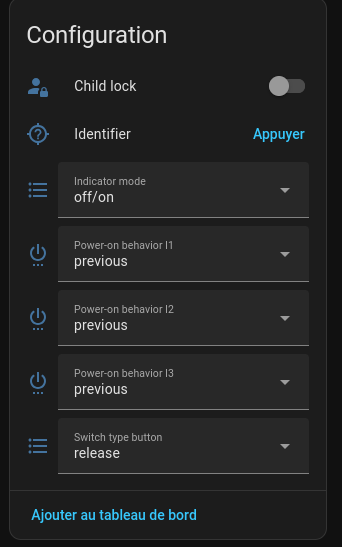
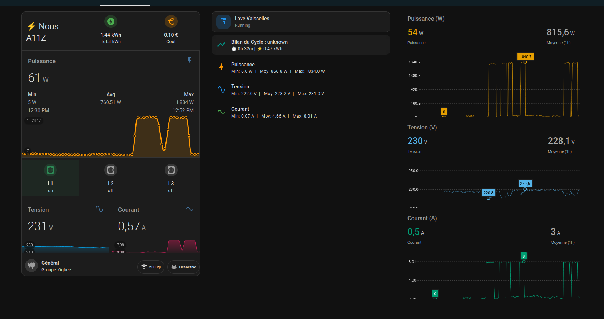

# Test de la Multiprise Connectée Zigbee Nous A11Z

## Contexte et Choix du Produit
Dans le cadre de nos partenariats, **HACF** a reçu une proposition de test de la part de **Domadoo** pour explorer leurs nouveautés. Mon choix s'est porté sur la multiprise connectée **[Nous A11Z](https://www.domadoo.fr/fr/produits-de-domotique/8713-nous-multiprise-zigbee-avec-mesure-de-consommation-a11z.html)**.

*Pourquoi ce choix ?* L'idée était de domotiser un "coin" complet avec un seul appareil. Si on pense souvent au coin TV (TV, ampli, console), j'avais pour ma part un autre scénario en tête : la **cuisine**. L'objectif est de piloter et mesurer la consommation d'appareils comme le lave-vaisselle ou la cafetière, le tout sur une seule prise murale.

## 📦 Déballage et Design
*La prise arrive emballée dans un carton simple mais efficace portant les logos Zigbee2MQTT et Home Assistant. Au déballage, elle semble de bonne facture, le plastique est de qualité et les finitions sont bonnes. Le câble est assez long (1.5m) pour une utilisation confortable. Le bouton unique est bien accessible et le voyant LED est visible mais pas trop agressif.*


*Le packaging simple et efficace.*


*La multiprise une fois déballée.*

## ⚙️ Configuration de Test
Pour ce test, la multiprise est intégrée dans un environnement complet :

*   **Home Assistant** :
    *   **Version** : HAOS (Core 2026.1.3, Supervisor 2026.02.1).
    *   **OS** : Home Assistant OS 17.0.
    *   **Matériel** : MiniPC N150 (16 Go RAM).

*   **Zigbee2MQTT** :
    *   **Version** : 2.8.0 (Installation Docker déportée).
    *   **Hébergement** : VM sous Proxmox (Sur MiniPC Ryzen 7, 32 Go RAM).
    *   **Contrôleur Zigbee** : SLZB-06M (PoE/Ethernet).

## 🔌 Installation et Appairage Z2M
Passons aux choses sérieuses. L'appairage sous **Zigbee2MQTT** se fait classiquement : un appui long sur le bouton unique, la LED clignote, et Z2M détecte l'appareil.


L'appareil est reconnu comme un modèle `TS011F` par le fabricant `_TZ3210_6cmeijtd`. Jusqu'ici, tout va bien. Les commandes apparaissent dans Home Assistant dés que l'interview est terminée. Mais...


## 🤨 La Première Déconvenue
C'est au moment du premier test que l'enthousiasme retombe.
Je tente d'allumer la prise 1... et **clac-clac-clac**, les trois prises s'allument en même temps !
J'essaie d'éteindre la prise 2 ? Tout s'éteint.


Impossible de piloter les prises individuellement. La multiprise réagit comme un bloc unique, une simple multiprise "bête" pilotable en tout-ou-rien.
Pire encore, en regardant les remontées d'énergie pour voir si au moins la consommation est suivie : **Rien**. Voltage à 0, Puissance à 0.

On se retrouve donc avec un produit inutilisable pour le projet initial. Mais, comme je n'aime pas les echecs de ce genre, j'ai commencé a fouiner.

## 🕵️‍♂️ L'Enquête

Face à ce comportement étrange, le premier réflexe est de vérifier si le problème est connu.
Sur les forums et les groupes communautaires, la **Nous A11Z** est pourtant souvent recommandée pour sa compatibilité. De nombreux utilisateurs semblent l'utiliser sans encombre. S'agit-il d'un défaut de mon exemplaire ?

En creusant davantage, on réalise que sous la même référence commerciale "A11Z" se cachent plusieurs versions matérielles.
*   **Les anciens modèles** utilisaient des codes fabricants génériques Tuya (souvent commençant par `_TZ3000_...`) qui étaient correctement reconnus et fonctionnels.
*   **La nouvelle révision (2026)**, identifiée par le code **`_TZ3210_6cmeijtd`**, utilise un firmware différent qui a posé problème lors de sa sortie.

Fort heureusement, la communauté open-source est incroyablement réactive. Moins de quelques semaines après l'apparition du problème (documenté sur l'issue [#30799](https://github.com/Koenkk/zigbee2mqtt/issues/30799)), un correctif a été proposé et est **désormais intégré nativement depuis la version 2.9.0 de Zigbee2MQTT**.


*Extrait du Changelog officiel validant le support.*

> [!NOTE]
> **Bonne nouvelle !**
> Si votre conteneur Zigbee2MQTT est à jour, vous n'avez **absolument rien de spécial à faire**. L'appareil est reconnu immédiatement et les trois prises sont pilotables nativement et individuellement.

Dès l'inclusion (ou après une simple mise à jour de votre instance Z2M), l'appareil expose correctement les 3 switchs indépendants (`state_l1`, `state_l2`, `state_l3`) ainsi que les sécurités enfants et les mémoires d'état. 


*Les commandes individuelles parfaitement reconnues nativement dans Zigbee2MQTT 2.9.0*

Dans Home Assistant, vous retrouvez désormais vos entités bien séparées :





---

### Optimisation du Polling

Pour avoir des **graphiques fluides** (comme ceux présentés dans cet article), il est recommandé de réduire l'intervalle de remontée des infos :
1.  Dans **Zigbee2MQTT**, cliquez sur l'appareil **Nous A11Z**.
2.  Allez dans l'onglet **Paramètres (Spécifique)**.
3.  Cherchez **Measurement Poll Interval** et réglez-le sur **10 secondes** (au lieu de 60 par défaut, vous pourrez repasser a 60 aprés vos tests).
4.  Sauvegardez.

Cela permet d'avoir une mesure quasi temps-réel, indispensable pour détecter les pics de consommation d'un cycle de lavage.

## ✅ Tests Effectués

### Test 01 : Calibration & Validation
Pour valider les mesures, une calibration a été effectuée avec une charge résistive de référence (Lampe à incandescence "Lava Lamp" de 25W).

*   **Protocole** : Mesure sur Prise 1, puis Prise 2.
*   **Résultats mesurés** :
    *   **Tension** : 228 V (Cohérent réseau).
    *   **Puissance** : 26 W (Pour 25W théorique -> Précision excellente).
    *   **Courant** : 0.11 A.
*   **Conclusion du test** : La prise remonte des données précises et la remontée consommation est **globale** (pas de mesure par prise individuelle, c'est la seule limitation de ce modèle).

### Test 02 : Mémoire d'État (Power Outage Memory)
*   **Protocole** : Coupure brutale de l'alimentation alors que les prises sont dans des états différents (ON/OFF).
*   **Résultat** : Au rétablissement du courant, chaque prise reprend exactement son état précédent.
*   **Validation** : ✅ Fonctionnel (l'option `powerOutageMemory: true` du script est bien active).

### Test 03 : Sécurité Enfant (Child Lock)
*   **Protocole** : Activation du `child_lock` dans Z2M et tentative d'action physique sur le bouton de la multiprise.
*   **Résultat** : Le bouton physique est désactivé, impossible d'éteindre/allumer manuellement.
*   **Validation** : ✅ Fonctionnel.

### Test 04 : Latence & Groupes (Pop-corn Effect)
*   **Protocole** : Création d'un groupe Zigbee regroupant les 3 prises et envoi d'une commande unique (ON/OFF).
*   **Résultat** : Les prises commutent en "cascade" (l'une après l'autre) et non simultanément (Effet "Pop-corn").
*   **Conclusion** : Le firmware semble traiter les commandes séquentiellement, même via un groupe Zigbee. Pas de commutation instantanée synchronisée.

### Test 05 : Lave-Vaisselle (Charge Réelle)
*   **Protocole** : Cycle complet de lavage en mode Intensif. Suivi de la puissance crête et de la consommation totale.
*   **Intérêts** : Valider la tenue de charge sur la durée et la précision du cumul kWh.
*   **Outils utilisés** :
    *   **Dashboard Energie Home Assistant** : Pour le suivi du coût global (en intégrant le capteur `sensor.multi_nous_energy`).
    *   **Intégration [HA WashData](https://github.com/3dg1luk43/ha_washdata)** : Une pépite découverte récemment ! Elle permet de :
        *   Détecter automatiquement les cycles (Lavage, Séchage, Fin).
        *   Reconnaître les programmes spécifiques (Eco, Rapide) via la signature de consommation.
        *   Estimer le temps restant intelligent.
        *   Envoyer des notifications précises ("Lave-vaisselle terminé ! Coût : 0.15€").
    *   *Résultats à venir après le premier cycle complet.*

    **📅 Mise à jour : Analyse du premier cycle (Mode Intensif)**
    
    Le test est concluant ! Voici ce que le Dashboard ApexCharts nous révèle sur un cycle complet :
    
    

    **Analyse des Courbes :**
    1.  **Les Pics de Chauffe (Orange)** : On distingue très nettement les phases où la résistance s'active pour chauffer l'eau (pics à ~2000W). C'est là que la consommation est la plus forte.
    2.  **L'Activité Moteur (Bas du graphe)** : Entre les chauffe, la consommation retombe (pompes de cyclage/vidange), ce qui montre bien la phase de brassage.
    3.  **Stabilité de la Tension (Bleu)** : Le graphique de tension (Voltage) reste très stable (~230V), prouvant que la ligne n'est pas surchargée malgré les appels de puissance.

    *Conclusion : La prise encaisse parfaitement les 2000W+ répétés et le monitoring est d'une précision redoutable pour analyser l'état de santé de l'électroménager.*

### Test 06 : Stress Test (Charge Maximale)
*   **Protocole** : Lave-vaisselle en cycle de nettoyage + Aspirateur branché sur la même multiprise.
*   **Mesure** : Pic de puissance observé à **2353 W** (~10.2 A).
*   **Observation** : Aucune chauffe détectée sur le boîtier de la multiprise après 5 minutes de test.
*   **Validation** : ✅ La multiprise tient la charge sans broncher. La connexion Zigbee reste stable même sous forte charge.

### Autres Mesures & Observations

En plus du test de calibration (Lampe 25W), voici quelques relevés intéressants sur des appareils du quotidien :

**1. Machine à Café (Pic de Courant)**
On observe bien les cycles de chauffe (résistance) :

*Les cycles de chauffe de la cafetière sont parfaitement visibles.*

**2. Machine Sous-Vide (Moteur)**
Profil typique d'un moteur électrique :

*Signature typique d'un moteur : appel de courant au démarrage.*

**3. Consommation à Vide (Standby)**
La multiprise elle-même consomme très peu (mesuré à 0W par Z2M, < 0.5W réel probablement) :

*La consommation à vide est négligeable.*

## 🎁 Bonus : Le Dashboard de Monitoring Complet

Pour surveiller cette multiprise durant mes tests (et surtout surveiller la consommation du lave-vaisselle !), je me suis concocté un **Dashboard complet** composé de 3 modules complémentaires.



### 1. Le "Monitor" (Vue Générale)
C'est la carte principale (Mushroom + Stack-in-card). Elle permet de :
*   Voir la conso totale et le coût instantané.
*   Suivre la puissance en direct (Mini Graph).
*   Piloter les 3 prises individuellement.
*   "Cat Lock" 😺 : Sécurité enfant activable en un clic.

Voici le code de la carte à ajouter à votre dashboard (nécessite `stack-in-card`, `mushroom` et `mini-graph-card`) :

```yaml
type: custom:stack-in-card
keep:
  background: false
  box_shadow: false
  margin: false
  outer_padding: false
  border_radius: false
cards:
  - type: horizontal-stack
    cards:
      - type: custom:mushroom-title-card
        title: ⚡ Nous A11Z
      #  subtitle: Laboratoire de Test
      - type: custom:mushroom-entity-card
        entity: sensor.multi_nous_energy
        primary_info: state
        secondary_info: name
        name: Total kWh
        icon: mdi:lightning-bolt-circle
        icon_color: green
        layout: vertical
        card_mod:
          style: |
            ha-card {
              border: none !important;
              box-shadow: none !important;
              background: none !important;
            }
      - type: custom:mushroom-template-card
        primary: "{{ (states('sensor.compteur_nous_a11z_total')|float(0) * states('input_number.cout_du_kwh')|float(0)) | round(2) }} €"
        secondary: "Coût ({{ states('input_number.cout_du_kwh') }} €/kWh)"
        icon: mdi:currency-eur
        icon_color: orange
        layout: vertical
        card_mod:
          style: |
            ha-card {
              border: none !important;
              box-shadow: none !important;
              background: none !important;
            }
  - type: custom:mini-graph-card
    entities:
      - entity: sensor.multi_nous_power
        name: Puissance
        color: "#ff9800"
    show:
      graph: line
      fill: true
      labels: true
      name: true
      state: true
      legend: false
      icon: true
      points: true
      extrema: true
      average: true
    line_width: 3
    height: 120
    hours_to_show: 1
    points_per_hour: 60
    animate: true
    color_thresholds:
      - value: 0
        color: "#4caf50"
      - value: 100
        color: "#ff9800"
      - value: 2000
        color: "#f44336"
    card_mod:
      style: |
        ha-card {
          margin-bottom: 0px !important;
        }
  - type: horizontal-stack
    cards:
      - type: custom:mushroom-template-card
        primary: L1
        secondary: "{{ states('switch.multi_nous_l1') }}"
        icon: mdi:power-socket-eu
        entity: switch.multi_nous_l1
        icon_color: "{{ 'seagreen' if is_state('switch.multi_nous_l1', 'on') else 'grey' }}"
        layout: vertical
        tap_action:
          action: toggle
        card_mod:
          style: |
            ha-card {
              background: {{ 'rgba(46, 139, 87, 0.1)' if is_state('switch.multi_nous_l1', 'on') else '' }} !important;
              border: none !important;
            }
      - type: custom:mushroom-template-card
        primary: L2
        secondary: "{{ states('switch.multi_nous_l2') }}"
        icon: mdi:power-socket-eu
        entity: switch.multi_nous_l2
        icon_color: "{{ 'seagreen' if is_state('switch.multi_nous_l2', 'on') else 'grey' }}"
        layout: vertical
        tap_action:
          action: toggle
        card_mod:
          style: |
            ha-card {
              background: {{ 'rgba(46, 139, 87, 0.1)' if is_state('switch.multi_nous_l2', 'on') else '' }} !important;
              border: none !important;
            }
      - type: custom:mushroom-template-card
        primary: L3
        secondary: "{{ states('switch.multi_nous_l3') }}"
        icon: mdi:power-socket-eu
        entity: switch.multi_nous_l3
        icon_color: "{{ 'seagreen' if is_state('switch.multi_nous_l3', 'on') else 'grey' }}"
        layout: vertical
        tap_action:
          action: toggle
        card_mod:
          style: |
            ha-card {
              background: {{ 'rgba(46, 139, 87, 0.1)' if is_state('switch.multi_nous_l3', 'on') else '' }} !important;
              border: none !important;
            }
  - type: horizontal-stack
    cards:
      - type: custom:mini-graph-card
        entities:
          - sensor.multi_nous_voltage
        name: Tension
        icon: mdi:sine-wave
        line_color: "#03a9f4"
        line_width: 2
        show:
          graph: line
          fill: fade
          labels: true
          name: true
          state: true
        height: 80
        hours_to_show: 1
        points_per_hour: 10
        update_interval: 30
        cache: false
        smoothing: false
        lower_bound: 210
        upper_bound: 250
        card_mod:
          style: |
            ha-card {
              border: none !important;
              box-shadow: none !important;
              background: none !important;
            }
      - type: custom:mini-graph-card
        entities:
          - sensor.multi_nous_current
        name: Courant
        icon: mdi:current-ac
        line_color: "#e91e63"
        line_width: 2
        show:
          graph: line
          fill: fade
          labels: true
          icon: true
          name: true
          state: true
        height: 80
        hours_to_show: 1
        points_per_hour: 60
        card_mod:
          style: |
            ha-card {
              border: none !important;
              box-shadow: none !important;
              background: none !important;
            }
  - type: horizontal-stack
    cards:
      - type: custom:mushroom-template-card
        primary: Général
        secondary: Groupe Zigbee
        icon: hue:plug-group
        entity: switch.test_a11z
        icon_color: "{{ 'seagreen' if is_state('switch.test_a11z', 'on') else 'grey' }}"
        layout: horizontal
        tap_action:
          action: toggle
        card_mod:
          style: |
            ha-card {
              background: {{ 'rgba(46, 139, 87, 0.1)' if is_state('switch.test_a11z', 'on') else '' }} !important;
              border: none !important;
            }
      - type: custom:mushroom-chips-card
        chips:
          - type: template
            entity: sensor.multi_nous_linkquality
            icon: mdi:wifi
            content: "{{ states('sensor.multi_nous_linkquality') }} lqi"
            icon_color: >-
              {{ 'seagreen' if states('sensor.multi_nous_linkquality')|int > 100
              else 'orange' }}
            tap_action:
              action: more-info
          - type: template
            entity: switch.multi_nous_child_lock
            icon: mdi:cat
            content: >-
              {{ 'Activé' if is_state('switch.multi_nous_child_lock', 'on') else
              'Désactivé' }}
            icon_color: >-
              {{ 'seagreen' if is_state('switch.multi_nous_child_lock', 'on')
              else 'grey' }}
            tap_action:
              action: toggle
        alignment: end
        card_mod:
          style: |
            ha-card {
              margin-top: 12px; 
            }
```

### 2. L'Analyseur de Cycle (Stats Auto)
Un sensor intelligent qui détecte **automatiquement** quand la prise tourne (Start > 5W / Stop < 2W).
Il génère un rapport précis à la fin du cycle :
*   **Temps** du cycle.
*   **kWh** consommés sur CE cycle.
*   **Mini/Max/Moy** pour la Puissance, Tension et Courant.

**Installation :**

1.  Ajoutez ce code dans votre configuration `template:` sur Home Assistant (ou dans un fichier package) :

```yaml
- trigger:
    # DÉMARRAGE DU CYCLE (Puissance > 5W pendant 10 sec)
    - platform: numeric_state
      entity_id: sensor.multi_nous_power
      above: 5
      for: "00:00:10"
      id: "start"
    
    # FIN DU CYCLE (Puissance < 2W pendant 5 min)
    - platform: numeric_state
      entity_id: sensor.multi_nous_power
      below: 2
      for: "00:05:00"
      id: "stop"
    
    # MISE À JOUR (Chaque changement de puissance, tension ou courant)
    - platform: state
      entity_id: 
        - sensor.multi_nous_power
        - sensor.multi_nous_voltage
        - sensor.multi_nous_current
      id: "update"

  sensor:
    - name: "Nous A11Z - Stats Cycle"
      unique_id: nous_a11z_stats_cycle
      icon: mdi:chart-box-outline
      state: >
        
          En cours
        
          Terminé
        
          {{ states('sensor.nous_a11z_stats_cycle') }}
        
      
      attributes:
        # --- COMPTEUR ECHANTILLONS (Pour moyennes) ---
        scan_count: >
          
            0
          
            {{ this.attributes.scan_count | default(0) | int + 1 }}
          

        # --- TEMPS ---
        start_time: >
          
            {{ now().isoformat() }}
          
            {{ this.attributes.start_time | default(now().isoformat()) }}
          
        
        end_time: >
          
            None
          
            {{ now().isoformat() }}
          
            {{ this.attributes.end_time | default('None') }}
          
        
        duration: >
          
            
            
            {{ (end - start).total_seconds() | int }}
          
            0
          

        # --- ENERGIE ---
        initial_energy: >
          
            {{ states('sensor.multi_nous_energy') | float(0) }}
          
            {{ this.attributes.initial_energy | default(states('sensor.multi_nous_energy') | float(0)) }}
          
        
        energy_consumed: >
          
          
          {{ (current - initial) | round(3) }}
        
        # ====================================================
        # STATISTIQUES (Min > 0 / Max / Avg)
        # ====================================================

        # --- POWER (W) ---
        avg_power: >
          {# Methode Energie / Temps (Plus précis pour la puissance) #}
          
          
          
            {{ ((energy * 1000) / (duration / 3600)) | round(1) }}
          
            {{ states('sensor.multi_nous_power') | float(0) }}
          

        max_power: >
          
          
            {{ val }}
          
            {{ [val, this.attributes.max_power | default(0) | float] | max }}
          

        min_power: >
          
          
            {{ val if val > 0 else 9999 }}
          
            
            
              {{ [val, current_min] | min }}
            
              {{ current_min }}
            
          

        # --- VOLTAGE (V) ---
        avg_voltage: >
          {# Moyenne glissante : avg_new = avg_old + (val - avg_old) / count #}
          
          
          
            {{ val }}
          
            
            {{ (old_avg + (val - old_avg) / count) | round(1) }}
          

        max_voltage: >
          
          
            {{ val }}
          
            {{ [val, this.attributes.max_voltage | default(0) | float] | max }}
          

        min_voltage: >
          
          
            {{ val if val > 0 else 250 }}
          
            
            
              {{ [val, current_min] | min }}
            
              {{ current_min }}
            
          

        # --- CURRENT (A) ---
        avg_current: >
          {# Moyenne glissante #}
          
          
          
            {{ val }}
          
            
            {{ (old_avg + (val - old_avg) / count) | round(2) }}
          

        max_current: >
          
          
            {{ val }}
          
            {{ [val, this.attributes.max_current | default(0) | float] | max }}
          

        min_current: >
          
          
            {{ val if val > 0 else 99 }}
          
            
            
              {{ [val, current_min] | min }}
            
              {{ current_min }}
            
          
```

2.  Ajoutez ensuite cette carte dans votre dashboard pour visualiser les résultats :

```yaml
type: vertical-stack
cards:
  # TITRE & INFOS GLOBALES
  - type: custom:mushroom-template-card
    primary: "Bilan du Cycle : {{ states('sensor.nous_a11z_stats_cycle') }}"
    secondary: >-
      
      
      {% set m = ((t % 3600) / 60) | int %}
      ⏱️ {{ h }}h {{ m }}m  |  ⚡ {{ state_attr('sensor.nous_a11z_stats_cycle', 'energy_consumed') }} kWh
    icon: mdi:chart-timeline-variant
    icon_color: teal
    layout: horizontal
    card_mod:
      style: |
        ha-card {
          background: rgba(40, 40, 40, 0.5) !important;
          border: none !important;
        }

  # 1. PUISSANCE (W)
  - type: custom:mushroom-template-card
    primary: "Puissance"
    secondary: >-
      Min: {{ state_attr('sensor.nous_a11z_stats_cycle', 'min_power') }} W  |  
      Moy: {{ state_attr('sensor.nous_a11z_stats_cycle', 'avg_power') }} W  |  
      Max: {{ state_attr('sensor.nous_a11z_stats_cycle', 'max_power') }} W
    icon: mdi:lightning-bolt
    icon_color: orange
    layout: horizontal
    multiline_secondary: true
    card_mod:
      style: |
        ha-card {
          background: none !important;
          border: none !important;
          box-shadow: none !important;
        }

  # 2. TENSION (V)
  - type: custom:mushroom-template-card
    primary: "Tension"
    secondary: >-
      Min: {{ state_attr('sensor.nous_a11z_stats_cycle', 'min_voltage') }} V  |  
      Moy: {{ state_attr('sensor.nous_a11z_stats_cycle', 'avg_voltage') }} V  |  
      Max: {{ state_attr('sensor.nous_a11z_stats_cycle', 'max_voltage') }} V
    icon: mdi:sine-wave
    icon_color: blue
    layout: horizontal
    multiline_secondary: true
    card_mod:
      style: |
        ha-card {
          background: none !important;
          border: none !important;
          box-shadow: none !important;
        }

  # 3. COURANT (A)
  - type: custom:mushroom-template-card
    primary: "Courant"
    secondary: >-
      Min: {{ state_attr('sensor.nous_a11z_stats_cycle', 'min_current') }} A  |  
      Moy: {{ state_attr('sensor.nous_a11z_stats_cycle', 'avg_current') }} A  |  
      Max: {{ state_attr('sensor.nous_a11z_stats_cycle', 'max_current') }} A
    icon: mdi:current-ac
    icon_color: green
    layout: horizontal
    multiline_secondary: true
    card_mod:
      style: |
        ha-card {
          background: none !important;
          border: none !important;
          box-shadow: none !important;
        }
```

### 3. Le "Debug" (Graphiques Précis)
Pour les puristes, une vue détaillée basée sur `apexcharts-card` permet de zoomer sur les courbes de Tension, Courant et Puissance avec un échantillonnage fin et une moyenne glissante.

Voici le code de la carte (nécessite `apexcharts-card`) :

```yaml
type: vertical-stack
cards:
  # 1. PUISSANCE
  - type: custom:apexcharts-card
    header:
      show: true
      title: "Puissance (W)"
      show_states: true
      colorize_states: true
    graph_span: 3.5h
    layout: minimal
    apex_config:
      chart:
        height: 200
        background: transparent
        zoom:
          enabled: true
          type: x
          autoScaleYaxis: true
      stroke:
        width: 1
        curve: smooth
      grid:
        show: true
        borderColor: '#404040'
        strokeDashArray: 3
    yaxis:
      - id: power
        show: true
        decimals: 1
    series:
      - entity: sensor.multi_nous_power
        name: Puissance
        color: "#E69F00" # Orange
        opacity: 0.8
        group_by:
          func: avg
          duration: 30s
        show:
          extremas: true # Affiche Min/Max
      
      - entity: sensor.multi_nous_power
        name: Moyenne (1h)
        color: "#A9A9A9" # Gris
        opacity: 0.5
        group_by:
          func: avg
          duration: 1h
        stroke_width: 2
        show:
          in_chart: false # Juste pour la légende
          legend_value: true
    card_mod:
      style: |
        ha-card {
          background: none !important;
          border: none !important;
          box-shadow: none !important;
        }

  # 2. TENSION
  - type: custom:apexcharts-card
    header:
      show: true
      title: "Tension (V)"
      show_states: true
      colorize_states: true
    graph_span: 3.5h
    layout: minimal
    apex_config:
      chart:
        height: 150
        background: transparent
        zoom:
          enabled: true
          type: x
          autoScaleYaxis: true
      stroke:
        width: 1
        curve: smooth
      grid:
        show: true
        borderColor: '#404040'
        strokeDashArray: 3
    yaxis:
      - id: voltage
        show: true
        decimals: 1
        min: 210
        max: 250
    series:
      - entity: sensor.multi_nous_voltage
        name: Tension
        color: "#56B4E9" # Bleu
        stroke_width: 1
        opacity: 0.7
        group_by:
          func: avg
          duration: 1m
        show:
          extremas: true # Affiche Min/Max en labels
      
      - entity: sensor.multi_nous_voltage
        name: Moyenne (1h)
        color: "#A9A9A9"
        group_by:
          func: avg
          duration: 1h
        show:
          in_chart: false
          legend_value: true
    card_mod:
      style: |
        ha-card {
          background: none !important;
          border: none !important;
          box-shadow: none !important;
        }

  # 3. COURANT
  - type: custom:apexcharts-card
    header:
      show: true
      title: "Courant (A)"
      show_states: true
      colorize_states: true
    graph_span: 3.5h
    layout: minimal
    apex_config:
      chart:
        height: 150
        background: transparent
        zoom:
          enabled: true
          type: x
          autoScaleYaxis: true
      stroke:
        width: 1
        curve: smooth
      grid:
        show: true
        borderColor: '#404040'
        strokeDashArray: 3
    yaxis:
      - id: current
        show: true
        decimals: 2
    series:
      - entity: sensor.multi_nous_current
        name: Courant
        color: "#009E73" # Vert
        stroke_width: 1
        group_by:
          func: avg
          duration: 30s
        show:
          legend_value: true
          extremas: true # Affiche Min/Max
      
      - entity: sensor.multi_nous_current
        name: Moyenne (1h)
        color: "#A9A9A9"
        group_by:
          func: avg
          duration: 1h
        show:
          in_chart: false
          legend_value: true
    card_mod:
      style: |
        ha-card {
          background: none !important;
          border: none !important;
          box-shadow: none !important;
        }
```

## 🧪 Tests

Plusieurs tests restent à faire avec cette multiprise notamment :
*   Validation de la stabilité du mesh Zigbee.

## Conclusion

La **Nous A11Z** (version 2026) a connu un démarrage difficile à cause d'un firmware capricieux, mais grâce à la communauté Zigbee2MQTT, ce n'est plus qu'un mauvais souvenir.

Aujourd'hui, c'est un produit "plug & play", reconnu nativement, qui offre un excellent rapport qualité/prix. Les prises commutent individuellement avec l'effet "pop-corn" pour protéger des appels de charge, et la mesure de consommation globale est d'une grande précision.
Dommage que la mesure de consommation soit **globale** et pas par prise individuelle, ce qui peut limiter certains usages pointus d'analyse de charge séparée.

Je pensais l'utiliser en cuisine pour entre autres gérer le lave-vaisselle, mais finalement, à cause de cette mesure globale, elle va finir derrière une TV et un ampli pour couper les veilles tout en monitorant la consommation complète du meuble.

### Résumé
*   ✅ **Les +** : Qualité de fabrication, 3 prises individuelles indépendantes, routeur Zigbee stable, intégration native fluide, Prix !
*   ❌ **Les -** : Mesure énergétique globale uniquement (pas détaillée par plot).

---

## 🗄️ Annexe : L'Ancienne Méthode Manuelle (Firmwares < 2.9.0)

> [!WARNING]
> **Méthode Obsolète (Archive)**
>
> *Le tutoriel ci-dessous est conservé uniquement pour de l'archivage ou si vous êtes bloqué sur une très ancienne version de Zigbee2MQTT (< 2.9.0).*

Grâce à la communauté, un convertisseur personnalisé permettait de contourner le problème et d'utiliser l'appareil normalement en attendant la mise à jour officielle.

### Étape 1 : Création du Fichier JS

Créez un fichier nommé `nous_a11z.js` dans le dossier de configuration de Zigbee2MQTT (à côté de `configuration.yaml`).
(Vous pouvez trouver le fichier source ici : [`z2m/nous_a11z.js`](../z2m/nous_a11z.js))

```javascript
const tuya = require('zigbee-herdsman-converters/lib/tuya');
const utils = require('zigbee-herdsman-converters/lib/utils');
const exposes = require('zigbee-herdsman-converters/lib/exposes');
const e = exposes.presets;
const ea = exposes.access;

const definition = {
    fingerprint: [{ modelID: 'TS011F', manufacturerName: '_TZ3210_6cmeijtd' }],
    model: 'A11Z',
    vendor: 'Nous',
    description: 'Smart power strip 3 gang with energy monitoring & countdown',

    // Mapping endpoints
    endpoint: (device) => {
        return { l1: 1, l2: 2, l3: 3 };
    },

    // Skip global endpoints for electrical measurements
    meta: {
        multiEndpoint: true,
        multiEndpointSkip: ['energy', 'current', 'voltage', 'power'],
    },

    extend: [
        // Configuration moderne Tuya pour Switch + Mesures
        tuya.modernExtend.tuyaOnOff({
            electricalMeasurements: true,   // Active la mesure
            powerOutageMemory: true,        // Active la mémoire d'état
            onOffCountdown: true,           // Active le compte à rebours
            indicatorMode: true,            // Active le mode LED
            childLock: true,                // Active le verrouillage enfant
            endpoints: ['l1', 'l2', 'l3'],  // Définit les 3 prises
        }),
        // Sondage régulier pour la mise à jour des valeurs
        tuya.modernExtend.electricityMeasurementPoll({
            metering: (device) => [100, 160, 192].includes(device.applicationVersion) || (device.softwareBuildID && ["1.0.5"].includes(device.softwareBuildID)),
        }),
    ],

    configure: async (device, coordinatorEndpoint, logger) => {
        const endpoint = device.getEndpoint(1);

        // 1. Envoi du Magic Packet (Nécessaire pour séparer les canaux sur certains firmwares)
        await tuya.configureMagicPacket(device, coordinatorEndpoint, logger);

        // 2. Calibration des Mesures Électriques
        await endpoint.saveClusterAttributeKeyValue('haElectricalMeasurement', {
            acCurrentDivisor: 1000,
            acCurrentMultiplier: 1,
            acVoltageDivisor: 1,    // 230V brut -> 230V affiché
            acVoltageMultiplier: 1,
            acPowerDivisor: 10,     // 260 brut / 10 = 26W
            acPowerMultiplier: 1,
        });

        // Configuration du metering (Energie cumulée)
        await endpoint.saveClusterAttributeKeyValue('seMetering', {
            divisor: 100,
            multiplier: 1,
        });

        device.save();
    },
};

module.exports = definition;
```

### Étape 2 : Activation

Ajoutez ceci à votre `configuration.yaml` :

```yaml
external_converters:
  - nous_a11z.js
```

### Étape 3 : Redémarrage

Redémarrez Zigbee2MQTT. Elle devrait maintenant exposer correctement 3 switchs indépendants (`state_l1`, `state_l2`, `state_l3`). *Note : Sur d'anciennes versions du firmware, la tension (Voltage) pouvait s'afficher autour de 20-23V au lieu de 230V.*

---
*Article rédigé par Canabang pour HACF.*
